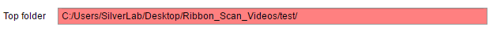

# Behaviour toolbox

This toolbox was created to streamline ROI selection for Video acquisition in the SilverLab. The general use case is the following one:

-   You recorded mouse behaviour using one or multiple camera.

-   You need to check all your many many videos, and select some ROI (for motion index, pupil tracking)
    
-   The location of these ROI is not exactly the same across days, so you need to do visual inspection

This toolbox will help go through all the video as fast as possible, easily manipulate/Select ROIs. The Results are stored in a database-like structure (see below). ROI location and other video info can be manipulated to do batch analysis. The only preparatory work required is to regroup the videos folders by day and experiments.

The Default analysis extract the motion index, for each ROI. Howver you can apply different function based on your needs (extract small video bouts for DeepLabCut, extract Pupil diameter from an Eye ROI... ). See [examples](#Other-use-case-for-ROIs).

Setup and general information
=============================

Setup
-----

The current toolbox is in the private repository: <https://github.com/SilverLabUCL/behaviour_toolbox>

Please use the master branch, contact the Developers if you don't have access. 

Download the repository, and add the files to the matlab path. You need to install the MATLAB `Image Processing Toolbox` if you don't have it. No other external dependencies are required.

### Video Folder Pre-processing

The database uses the lab filename system to organize the results. Before starting, you must put all your video of interest together, in a same "top folder", and if possible, move all the video belonging to other experiments elsewhere, in another folder. The system uses the fact that videos taken during a same experiment point at the same location. Therefore, they must be regrouped by experiments.

The Video folders must be organized as follow:

```
/Top_folder/ (contains all the videos to monitor. Take irrelevant videos away)
├───/YYYY-MM-DD/
|   ├──/experiment_1/
|   |  ├─ /YYMMDD_HH_mm_ss VidRec/
|   |  ├─ /YYMMDD_HH_mm_ss VidRec/
|   |
|   ├──/experiment_2/
|   |  ├─ /YYMMDD_HH_mm_ss VidRec/
|
├───/yyyy-mm-dd/
       ├─ ...
```


Each LabVIEW video folder (*/YYMMDD_HH_mm_ss VidRec/* folder ) is expected to contain exported .avi videos. The LabVIEW export process will organised files as required, so do not move them around. In the following example, 3 camera were used.

```
.../YYMMDD_HH_mm_ss VidRec/
   ├───/YYMMDD_HH_mm_ss VidRec/
   |   | BodyCam-1.avi
   |   | BodyCam-relative times.txt 		% Unused
   |   | EyeCam-1.avi
   |   | EyeCam-relative times.txt 			% Unused
   |   | WhiskersCam-1
   |   | WhiskersCam-relative times.txt 	% Unused
   |   |
   | BodyCam-relative times.txt
   | EyeCam-relative times.txt
   | WhiskersCam-relative times.txt
```


> Note: an "experiment" is defined by a series of consecutive video recordings where ROIs will be identical. Some computation will be shared between videos of the same experiment, using the same ROI location across the recordings, which means the camera must not move. Camera offset can be corrected, however, if you changed the camera angle or zoom factor, you will have to split the experiments in 2.
>

General data structure
----------------------

The data is organized following a hierarchical structure. Each level is defined by a Class, with its own methods and dynamic properties. Click on the classes to see more details about properties and methods.

[`Analysis_Set`](Analysis_Set.md) 		: The container for all your experiments

[`Experiment`](Experiment.md) 			: Each Experiment contains one or multiple recordings

[`Recording`](Recording.md)               : Each Recording contains one or multiple videos

[`Video`](Video.md)              		 : Each Video contains one or multiple ROIs

[`ROI`](ROI.md)             			  : ROIs enable video data extraction.

[`Extracted_Data`](Extracted_Data.md)    : Location of Extracted variables obtained from the ROI.

Each parent structure can list its children properties. See Class documentation, or see demo scripts at the end of the documentation for more details.

First run and database initialization
=====================================

Initialise the toolbox
----------------------

Start the GUI by typing

```matlab
Behaviour_analysis();
```

This will open the GUI.


> If you want to resume from a previous analysis, see the [backup section](#Manual-Reload)

Start a new analysis:
---------------------

Click on the [Start New Analysis] button. This would clear any existing dataset.


Select the folder containing all your video ("Top\_folder"), as described before. All valid videos in this folder will be listed. This may take some time, in particular if the videos are on a remote server. After this step, a local copy of the folder path is stored, which speed up data manipulation. If you change the content of the video folder, you will need to refresh this list. See [Updating Source]().

Please keep an eye at the messages printed during this initial listing, as they could indicate problematic videos. The toolbox does not support split videos (yet).

Once finished, you should see an updated GUI.

> Note : As this step can be very long, it is recommended to save your database once the list was generated. See [backup analysis](#Backup-Analysis)
>

Backup Analysis
===============

Manual backup
-------------

As some steps can be extremely time consuming, it is recommended to do some regular backup of your analysis database. To do so, click on the [Save Analysis] Button.


An automated filename with a timestamp is proposed, but you can edit it.

Manual Reload
-------------

If you resume a previous analysis, or if something went wrong and you want to return to a previous stage, you can use the [Load Existing Analysis] button and reload one of the '.mat' file used for backup.


If you want to directly start the GUI using a previous backup, use:

```matlab
Behaviour_analysis('saved_analysis 19-May-2020 16_47_15.mat')
```

If the Top folder field is red, it indicates that the video_path used last time has changed, either because you moved your videos or because you changed computer / Hard drive. You can edit the field if you need to extract/position new ROIs data. 



Recover from interrupted analysis
---------------------------------

When extracting motion indices, you may interrupt your MI extraction. An error could also emerge from a server connection issue, or a corrupted recording. If this happens, you can restore to the last valid state by
clicking on the [Recover interrupted analysis] button:

 

> Note : After doing this, you should immediately backup the database.

Auto saving
-----------

Temporarily disabled. See Recover from interrupted analysis.

Browse Data and Database
========================

Data selection
--------------

The experiment section lists the experiment available in the "top folder". You can select or multiple experiments at once.


Any data extraction will be done on the current selection.

The recordings listed in the selected experiments are displayed on the left


-   '*Eye*', '*Body*' and, '*Whisker*' columns indicated the availability of the videos. In the example above, the recording 17-27-01 only have a WhiskerCam recording, while other recordings have all video recordings.
    
-   The *selected MI* column indicates how many ROIs were selected for each video.
    
-   The *analysed* column indicates if the motion indices were all analysed or not.

Open Video/Open folder
----------------------

You can select a specific video, or open its containing folder by clicking on the [Open Video] or [Open Folder] buttons. For video, the selcted video is opened. For folders, the containing folder is opened.


Updating Database
-----------------

If you added or deleted folders, you can click on  the [Refresh File List] Button.


Existing analysis will be kept, new files will be added (in alphabetical order) and deleted folders will be removed.

> Note : This process will take as long as the initial listing, which can last seconds to minutes depending on the location and number of the files.

In the rare case where you (re)-add videos in an experiment where ROIs were already selected, you need to regenerate Motion Indices for all recordings by clicking on the [Select/Browse ROIs] Button again. The Missing MIs will be calculated next tie you click on the [Show/Analyze] button. 

Select ROIs
===========

Now that the files were listed, you can select the location of the ROIs. The process is done for all the selected *experiments*. ROIs are the same for all videos of a given experiment (unless there is missing video), although an offset can be applied to all ROIs if the camera moved.
For example, if you select an experiment that has recordings with the *EyeCam* and the *BodyCam*, you will have to select the location of you ROIs for each one of this video, but only once for the full experiment.

To select ROIs : Click on the [Select/Browse ROIs] button.


ROIs you already selected will be displayed. New ROIs can be added, and old ROIs can be removed.

Quick Selection
---------------


Preset names are displayed on the left. The list is extracted from the property `behaviour_GUI.Experiment_set.default_tags`. You can edit this list to add/remove quick tags.

Manual Addition
---------------

You can also do a right click on the image to add an ROI. Roi will be named in order of selection


Editing ROIs
------------

ROIs being added have they name in red. A right click on the ROI allow you to delete it.


Type the "return" key to validate and move to the net camera / next experiment. Once done on your selection, if you click on the [select/Browse ROIs] button again, the previously selected ROIs will be displayed in yellow.


Once selected, the number of ROIs in the selection is displayed in the table.


Analysis
========

Once defined, you can calculate motion index for each ROI. Select the experiment/Group of experiment to process in the "experiments" column, then click on the [Show/Analyze] button to start the analysis process. .

> By default, the metric extracted is the Motion Index (MI), which is the main example covered in this manual. However, you can choose to run different analysis functions based on your needs. See the [Custom Function](#Run-custom-functions-on-ROIs) section.

Videos that had all their Motion Index calculated are skipped, but if a new ROI was added or if a previous ROI was moved, it will be calculated. 

> Whatever the number of ROIs to recalculate, the function need to reload the entire video, which is what take the most time. Reextracting 1 or many ROI takes almost the same. This may not be true for custom functions.

If required, you can force the recalculation of MIs for all videos at any time by ticking the [Recalculate all] checkbox:


For each video, the analysis progress is displayed in the command. 


Note : Most of the time is taken by video loading. To speed up the analysis, it is recommended to have files on a local, fast drive (eg. SSD drive).

Once all MIs are calculated, checkboxes in the *analysed* column are ticked.


Updating Motion Indexes
=======================

Update a set of MIs
-------------------

If you already analysed an experiment/Group of experiments but want to check the position of the existing ROIs, proceed as follow:

-   Highlight the experiment to check. You can select or or multiple experiments


The individual recordings are displayed on the experiment window

-   Browse the experiments
    
-   ROIs that were analysed are displayed in green. These ROI were already extracted.


If you move/resize a green ROI, the label will turn yellow, indicating that a new MI extraction will be necessary.


After validating the change (i.e. after closing the window), the analysed checkbox will be unchecked, indicating that reanalysis is required.

> Note : If you move the Motion index on the consensus frame, the ROI is moved accordingly for all videos in that experiment

Correct for camera movement
---------------------------

During an experiment, you may have camera movement. You have the possibility to introduce and offset for all ROIs. ROIs will all have the same offset for a given video. ROI size cannot be changed during recordings

To correct for camera displacement, you must first specify ROI location in the consensus frame. When the camera moves, the consensus frame may be blurry or show multiple ghost images, due to a camera offset. The ROIs should be correct for the beginning of the experiment.


You can use the slider at the bottom of the figure to move across the recordings. The first position of the slider corresponds to the consensus frame, while the following ones correspond to each video of the recording.


For example, the ROIs were selected correctly for the first recording :


However, a later video displays an offset:


You can drag the ROIs (which will move together) to the correct location.


Note: The offset is automatically applied to all the following recordings, although you can set a second different offset on a later video (which will, in turn, be applied to all the subsequent video. See example below. In **bold**, we indicate the only video that actually needed a manual intervention.

| video | Mean frame | rec1 | rec2 | rec3 | rec4 | rec5 | rec6 | … | rec_N |
|:------:|:---------------:|:-----:|:-----:|:-------:|:-------:|:-------:|:-------:|:-------:|:-------:|
| offset | **[0,0]** | [0,0] | [0,0] | **[10,20]** | [10,20] | [10,20] | **[40,15]** | [40,15] | [40,15] |

> Note : Offsets are applied relative to the first frame (Mean Frame). Similarly, ROI size are defined in the Mean Frame. DO NOT add/remove/resize ROIs in the other frames (here, in rec1 to rec_N). You should only adjust for offsets in those.

You can clear all offset (if you are on the reference frame), or all offsets starting from the current recording (if you are on any other frame than the reference one) by clicking on the [Clear Offsets] button


Display MIs
---------------------

### For the current recording

When selecting the ROIs, you can have a preview of the signal obtained from the current ROIs by clicking on the [Measure MIs] button


Note than Motion indexes are not saved to the database when using preview. They will be extracted only when clicking on the [Show/Analyze] button.

### For the whole experiment, after extraction

If you extracted all Motion indices, you should see a figure like this


For each MI, a plot of the whole experiment is displayed (time in seconds). Grey areas indicate gaps between recordings.

If you extracted multiple ROIs, you will see multiple subplot.


> Note : if you want to pause the display between each Camera, tick the [Pause for each experiment] checkbox
>


Videos that were not extracted will still be analysed, so it is recommended to use this option only when all MIs were extracted, otherwise you may have to wait a long time when hitting an non-extracted recording.


Scripted analysis
=================

> Requirements : you must have arranged your data as explained [here](#Video-Folder-Pre-processing).

### Quick summary

Here is a quick example on how to extract MI's from scratch. More details about each steps are provided in the next sections

```matlab
%% Create object
my_analysis = Analysis_Set('D:\Video for Toolbox testing')

%% List all recordings
my_analysis = my_analysis.update();

%% Select MI's for a specific experiment (here experiment 1)
my_analysis.experiments(1).select_ROIs();

%% Extract MI's
my_analysis.analyze();

%% Display MI's and get output values
[data, t] = my_analysis.experiments(end).plot_MIs();
```

## Initial set up

### Using an existing Database for Analysis

If you did the initial part of the pipeline using the GUI, you can then use it for scripted analysis. 

The initial step is to isolate the Analysis_Set object. You can do this by extracting it from the GUI handle, or by reloaded a backup analysis

```matlab
%% Get the Analysis set handle from the GUI
my_analysis = behaviour_GUI.Experiment_set;

%% Get the Analysis set from a backup
load('some_backup.mat');
```

### Creating a new database

The other option is to create a whole database from scratch. For more details, see the [Analysis_Set](Analysis_Set.md),[Experiment](Experiment.md) and [Recording](Recording.md) Classes documentation.

```matlab
%% Create database
Analysis_Set('C:\Users\vanto\Desktop\Video for Toolbox testing\');
my_analysis.update(); % list all experiments
```
## Browse Data Properties

### Select Experiments

```matlab
%% Look at a few properties of experiment # 6
my_analysis.experiments(6).videotypes
>> ans =
      1×2 cell array
        {'BodyCam-1'}    {'EyeCam-1'}
        
my_analysis.experiments(6).n_rec
>> ans =
      3

```

### Select ROIs

```matlab
%% Select ROIs for experiment # 6
% There are 2 videos types in this experiment,
% - We set 2 ROIs around whiskers in video 1
% - We set 1 ROIs around whiskers in video 2
my_analysis.experiments(6).select_ROIs();

%% Look at a few properties of the ROIs we just selected. 
%% NOTE : we are going to use a handle, so the corresponding expe in my_analysis will be updated too 
expe = my_analysis.experiments(6); % for display

%% We can look at the ROIs of recording # 2;
% First video has 2 ROIs
% Second video has 1 ROI
ROIS = {expe.recordings(2).videos.rois}
>> ROIS =
  1×2 cell array
    {1×2 ROI}    {1×1 ROI}

%% We can look at the propeties of the first ROI of video 1
roi = expe.recordings(2).videos(1).rois(1)
>> roi = 
     ROI with properties:
               n_ROI: []
        ROI_location: [585.0909 174.5455 20 20 7513]
        motion_index: {}
                name: 'Label # 1'

% ROI_location  
round(roi.ROI_location)
>> ans =
         [585, 175, 20, 20, 7513]; % xstart, ystart, width, height, id
% The id is identifying an ROI in case it has the same name.
% for example  
	expe.recordings(1).videos(1).rois(2).ROI_location(5)
 == expe.recordings(3).videos(1).rois(2).ROI_location(5)
>> ans =
  logical
   		1

% but, although they have the same name in this case, we can distinguish ROIs across recordings
	expe.recordings(1).videos(1).rois(1).ROI_location(5)
 == expe.recordings(1).videos(2).rois(1).ROI_location(5)
>> ans =
  logical
   		0

% Look at selected motion indices (one per ROI) for recording 2:
% First video has 2 MIs (because there were 2 ROIs)
% Second video has 1 MI (because there was 1 ROIs)
expe.recordings(2).motion_indexes
>> ans =
     1×2 cell array
        {1×2 cell}    {1×1 cell} 
        
```

### Extract Motion index

```matlab
%% To extract MI for a specific video. 
my_analysis.experiments(6).recordings(2).videos(1).analyze();

%% Same, but using a handle
vid = my_analysis.experiments(6).recordings(2).videos(1); % for display purpose
vid = vid.analyze();

%% Plot MI for ROI # 2
figure();plot(vid.motion_indexes{2}(:,2), vid.motion_indexes{2}(:,1));
xlabel('time (ms)')
```


## Run custom functions on ROIs

The default analysis extract the Motion Index for all selected ROIs. However, you can extract the content of ROIs for other purposes, such as pupil tracking, or DeepLabCut. To do this you nned to pass a function handle, whci can be run at the video or individual ROI level, and can be filtered for specific ROIs if needed.

### Example 1 : Get Mean projection of ROIs

For this example, we are starting from the video defined in the [previous section](#Extract-Motion-index) :

```matlab
%% Demo Script : to extract mean image for a set of recordings
vid = my_analysis.experiments(6).recordings(2).videos(1); % for display purpose
im = vid.analyze(@(~,~) get_mean_proj(vid.path, vid.ROI_location{1}));
figure();imagesc(im);axis image

function im = get_mean_proj(file_path_or_data, ROI)
    [~, video] = get_MI_from_video(file_path_or_data, '', '', ROI);
    im = nanmean(video{1}, 3);
end
```

### Example 2 : Track Pupil diameter using an external function

For this example, we are going to run manually a function using pre-set ROI coordinates, and extract pupil tracking index

```Matlab
%% Get analysis handle (for clarity)
my_analysis = behaviour_GUI.Experiment_set;

%% Identify Videos with an Eye ROI
usable = cellfun(@(x) any(strcmp(x, 'Eye')), {my_analysis.experiments.roi_labels});

%% Now, for each ROI called "Eye", run pupil extraction
rendering = true;
thresh_factor = 1.5;
dark_prctile = 1;

%% Method 1, direct call
for exp_idx = usable
    for rec_idx = 1:my_analysis.experiments(idx).n_rec
        rec = my_analysis.experiments(exp_idx).recordings(rec_idx);
        for vid_idx = 1:rec.n_vid
            vid = rec.videos(vid_idx);
            EyeROI = find(cellfun(@(x) contains(x, 'Eye'), vid.roi_labels));
            if ~isempty(EyeROI)
                eye = vid.ROI_location{EyeROI};
                pupilFit = pupil_analysis(vid.path, rendering, thresh_factor, dark_prctile, eye);
            end
        end
    end
end

%% Method 2, using analyze() method and function callback
for exp_idx = usable
    for rec_idx = 1:my_analysis.experiments(idx).n_rec
        rec = my_analysis.experiments(exp_idx).recordings(rec_idx);
        for vid_idx = 1:rec.n_vid
            vid = rec.videos(vid_idx);
            data = vid.analyze(@(~,~) pupil_analysis(vid.path,...
            										rendering,...
                                                    thresh_factor,...
                                                    dark_prctile,...
                                                    vid.ROI_location{cellfun(@(x) contains(x, 'Eye'), vid.roi_labels)}), true);
        end
    end
end
            

```

### Example 3 : Store extracted metrics using an external function

For this example, we are going to run a function using pre-set ROI coordinates, and store info in a new field (not MI)

```matlab

```

