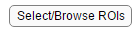

[Toc]


# Behaviour toolbox

This toolbox was created to streamline ROI selection for Video acquisition in the SilverLab. The general use case is the following one:

-   You recorded mouse behaviour using one or multiple camera.

-   You need to check all your many many videos, and select some ROI (for motion index, pupil tracking)
    
-   The location of these ROI is not exactly the same across days, so you need to do visual inspection

This toolbox will help go through all the video as fast as possible, easily manipulate/Select ROIs. The Results are stored in a database-like structure (see below). ROI location and other video info can be manipulated to do batch analysis. The only preparatory work required is to regroup the videos folders by day and experiments.

Setup and general information
=============================

Setup
-----

The current toolbox is in the private repository: <https://github.com/SilverLabUCL/behaviour_toolbox>

Please use the master branch, contact the Developers if you don't have access. 

Download the repository, and add the files to the matlab path. No other dependencies are required.

### Video Folder Pre-processing

The database uses the lab filename system to organize the results. Before starting, you must put all your video of interest together, in a same "top folder", and if possible, move all the video belonging to other experiments elsewhere, in another folder. The system uses the fact that videos taken during a same experiment point at the same location. Therefore, they must be regrouped by experiments.

The Video folders must be organized as follow:

```
/Top_folder/ (contains all the videos to monitor. Take irrelevant videos away)
├───/YYYY-MM-DD/
|   ├──/experiment_1/
|   |  ├─ /YYMMDD_HH_mm_ss VidRec/
|   |  ├─ /YYMMDD_HH_mm_ss VidRec/
|   |
|   ├──/experiment_2/
|   |  ├─ /YYMMDD_HH_mm_ss VidRec/
|
├───/yyyy-mm-dd/
       ├─ ...
```


Each LabVIEW video folder (*/YYMMDD_HH_mm_ss VidRec/* folder ) is expected to contain exported .avi videos. The LabVIEW export process will organised files as required, so do not move them around. In the following example, 3 camera were used.

```
.../YYMMDD_HH_mm_ss VidRec/
   ├───/YYMMDD_HH_mm_ss VidRec/
   |   | BodyCam-1.avi
   |   | BodyCam-relative times.txt 		% Unused
   |   | EyeCam-1.avi
   |   | EyeCam-relative times.txt 			% Unused
   |   | WhiskersCam-1
   |   | WhiskersCam-relative times.txt 	% Unused
   |   |
   | BodyCam-relative times.txt
   | EyeCam-relative times.txt
   | WhiskersCam-relative times.txt
```


> Note: an "experiment" is defined by a series of consecutive video recordings where ROIs will be identical. Some computation will be shared between videos of the same experiment, using the same ROI location across the recordings, which means the camera must not move. Camera offset can be corrected, however, if you changed the camera angle or zoom factor, you will have to split the experiments in 2.
>

General data structure
----------------------

The data is organized following a hierarchical structure. Each level is defined by a Class, with its own methods and dynamic properties

`Analysis_set`

`Experiment`

`Recording`

`Video`

`ROI`

Each parent structure can list its children properties. See Class documentation, or use cases at the end of the documentation for more details.

First run and database initialization
=====================================

Initialise the toolbox
----------------------

Start the GUI by typing

`some_name = Behaviour_analysis();`

This will open the GUI.

{width="6.268055555555556in" height="3.9625in"}

Start a new analysis:
---------------------

{width="1.4689545056867892in"
height="0.4896511373578303in"}Select the folder containing all your video ("Top\_folder"), as described before. All valid videos in this folder will be listed. This may take some time, in particular if the videos are on a remote server. After this step, a local copy of the folder path is stored, which speed up data manipulation. If you change the content of the video folder, you will need to refresh this list. See [Updating Source]().

Please keep an eye at the messages printed during this initial listing, as they could indicate problematic videos. The toolbox does not support split videos (yet).

Once finished, you should see an updated GUI.

> Note : As this step can be very long, it is recommended to save your database once the list was generated. See [backup analysis](#Backup-Analysis)
>

Backup Analysis
===============


Manual backup
-------------

As some steps can be extremely time consuming, it is recommended to do some regular backup of your analysis database. To do so, click on the [Save Analysis] Button.{width="1.354355861767279in"
height="0.3229615048118985in"}An automated filename with a timestamp is proposed, but you can edit it.

Manual Reload
-------------

If you resume a previous analysis, or if something went wrong and you want to return to a previous stage, you can use the [Load Existing Analysis] button and reload one of the '.mat' file used for backup.{width="1.531463254593176in"
height="0.33338035870516186in"}

Recover from interrupted analysis
---------------------------------

When extracting motion indices, you may interrupt your MI extraction. An error could also emerge from a server connection issue, or a corrupted recording. If this happens, you can restore to the last valid state by
clicking on {width="1.8127526246719161in"
height="0.27087160979877517in"}

> Note : After doing this, you should immediately backup the database.

Auto saving
-----------

Temporarily disabled.

Browse Data and Database
========================

Data selection
--------------

The experiment section lists the experiment available in the "top folder". You can select or multiple experiments at once.

{width="1.8127526246719161in"
height="1.2085017497812773in"}

Any data extraction will be done on the current selection.

The recordings listed in the selected experiments are displayed on the left

{width="6.268055555555556in"
height="1.4104166666666667in"}

-   '*Eye*', '*Body*' and, '*Whisker*' columns indicated the availability of the videos. In the example above, the recording 17-27-01 only have a WhiskerCam recording, while other recordings have all video recordings.
    
-   The *selected MI* column indicates how many ROIs were selected for each video.
    
-   The *analysed* column indicates if the motion indices were all analysed or not.

Open Video/Open folder
----------------------

You can select a specific video, or open its containing folder by clicking on the [Open Video] or [Open Folder] buttons. For video, the selcted video is opened. For folders, the containing folder is opened.

{width="6.268055555555556in"
height="0.29305555555555557in"}

{width="1.1147386264216972in"
height="0.6980139982502187in"}

Updating Database
-----------------

If you added or deleted folders, you can click on  the [Refresh File List] Button.
{width="1.177247375328084in"
height="0.3646347331583552in"}

Existing analysis will be kept, new files will be added (in alphabetical order) and deleted folders will be removed.

> Note : This process will take as long as the initial listing, which can last seconds to minutes depending on the location and number of the files.

Select ROIs
===========

Now that the files were listed, you can select the location of the ROIs. The process is done for all the selected *experiments*. ROIs are the same for all videos of a given experiment (unless there is missing video), although an offset can be applied to all ROIs if the camera moved.
For example, if you select an experiment that has recordings with the *EyeCam* and the *BodyCam*, you will have to select the location of you ROIs for each one of this video, but only once for the full experiment.

To select ROIs : Click on the [Select/Browse ROIs] button.
{width="1.4064457567804025in"
height="0.3125437445319335in"}

ROIs you already selected will be displayed. New ROIs can be added, and old ROIs can be removed.

Quick Selection
---------------

{width="1.3229166666666667in" height="1.625in"}

Preset names are displayed on the left. The list is extracted from the propertiy `behaviour_GUI.Experiment_set.default_tags`. You can edit this list to add/remove quick tags.

Manual Addition
---------------

You can also do a right click on the image to add an ROI. Roi will be named in order of selection

{width="1.2918471128608924in"
height="0.4896511373578303in"}
{width="0.8126137357830271in"
height="0.6980139982502187in"}

Editing ROIs
------------

ROIs being added have they name in red. A right click on the ROI allow you to delete it.

{width="2.0211154855643043in"
height="1.9273523622047244in"}{width="1.5210454943132108in"
height="1.0522298775153105in"}

Type the "return" key to validate and move to the net camera / next experiment. Once done on your selection, if you click on the [select/Browse ROIs] button again, the previously selected ROIs will be displayed in yellow.

{width="1.4272823709536309in"
height="1.5002088801399824in"}

Once selected, the number of ROIs in the selection is displayed in the table.

{width="6.268055555555556in" height="1.11875in"}

Analysis
========

Once defined, you can calculate motion index for each ROI. Select the experiment/Group of experiment to process in the "experiments" column, then click on the [Show/Analyze] button.{width="1.458536745406824in"
height="0.33338035870516186in"}

This will start the analysis process. Videos that had all their Motion Index calculated are skipped, but if
any new MI was added, we recalculate all MIs.

If required, you can force the recalculation of MIs for all videos at any time by ticking the [Recaluclate all] checkbox:

{width="1.1355752405949255in"
height="0.2500349956255468in"}

For each video, the analysis progress is displayed in the command. 

{width="0.78125in"
height="0.5678149606299212in"}

Note : Most of the time is taken by video loading. To speed up the analysis, it is recommended to have files on a local, fast drive (eg. SSD drive).

Once all MIs are calculated, checkboxes in the *analysed* column are ticked.

{width="2.792055993000875in"
height="0.9063768591426071in"}

Updating Motion Indexes
=======================

Update a set of MIs
-------------------

If you already analysed an experiment/Group of experiments but want to check the position of the existing ROIs, proceed as follow:

-   Highlight the experiment to check. You can select or or multiple experiments

{width="1.8648436132983377in"
height="0.6771773840769904in"}

The individual recordings are displayed on the experiment window

-   Browse the experiments{width="1.4377001312335957in"
    height="0.34379811898512685in"}
    
-   ROIs that were analysed are displayed in green. These ROI were already extracted.

{width="2.5732753718285215in"
height="2.3128226159230096in"}

If you move/resize a green ROI, the label will turn yellow, indicating that a new MI extraction will be necessary.

{width="1.1355752405949255in"
height="1.177247375328084in"}

After validating the change (i.e. after closing the window), the analysed checkbox will be unchecked, indicating that reanalysis is required.

> Note : If you move the Motion index on the consensus frame, the ROI is moved accordingly for all videos in that experiment

Correct for camera movement
---------------------------

During an experiment, you may have camera movement. You have the possibility to introduce and offset for all ROIs. ROIs will all have the same offset for a given video. ROI size cannot be changed during recordings

To correct for camera displacement, you must first specify ROI location in the consensus frame. When the camera moves, the consensus frame may be blurry or show multiple ghost images, due to a camera offset. The ROIs should be correct for the beginning of the experiment.

{width="3.34375in"
height="2.6587740594925635in"}

You can use the slider at the bottom of the figure to move across the recordings. The first position of the slider corresponds to the consensus frame, while the following ones correspond to each video of the recording.

{width="6.268055555555556in"
height="0.3541666666666667in"}

For example, the ROIs were selected correctly for the first recording :

{width="3.9270833333333335in"
height="3.16959864391951in"}

However, a later video displays an offset:

{width="4.958333333333333in"
height="3.843175853018373in"}

You can drag the ROIs (which will move together) to the correct location.

{width="4.875in" height="3.8142300962379703in"}

Note: The offset is automatically applied to all the following recordings, although you can set a second different offset on a later video (which will, in turn, be applied to all the subsequent video. See example below. In **bold**, we indicate the only video that actually needed a manual intervention.

| video | Mean frame | rec1 | rec2 | rec3 | rec4 | rec5 | rec6 | … | rec_N |
|:------:|:---------------:|:-----:|:-----:|:-------:|:-------:|:-------:|:-------:|:-------:|:-------:|
| offset | **[0,0]** | [0,0] | [0,0] | **[10,20]** | [10,20] | [10,20] | **[40,15]** | [40,15] | [40,15] |

> Note : Offsets are applied relative to the first frame (Mean Frame). Similarly, ROI size are defined in the Mean Frame. DO NOT add/remove/resize ROIs in the other frames (here, in rec1 to rec_N). You should only adjust for offsets in those.


Display extracted MIs
---------------------

If you extracted all Motion indices, you should see a figure like this

{width="6.268055555555556in"
height="1.7277777777777779in"}

For each MI, a plot of the whole experiment is displayed (time in seconds). Grey areas indicate gaps between recordings.

If you extracted multiple ROIs, you will see multiple subplot.

{width="6.268055555555556in"
height="3.9180555555555556in"}

If you extracted the same ROI in different videos, they will be displayed in the same subplot, one color per camera

Scripted analysis
=================

At any time, the database can be accessed and used for measurements. The most up-to-date version of the database is in

behaviour\_GUI.Experiment\_set

Example in the demo folder (used for extracting licking bouts in the MC
paper)

[...]


TODO : 

- Script
- Classes and Properties