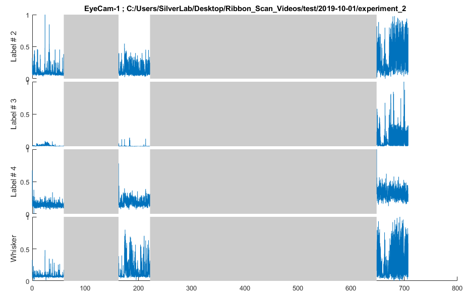
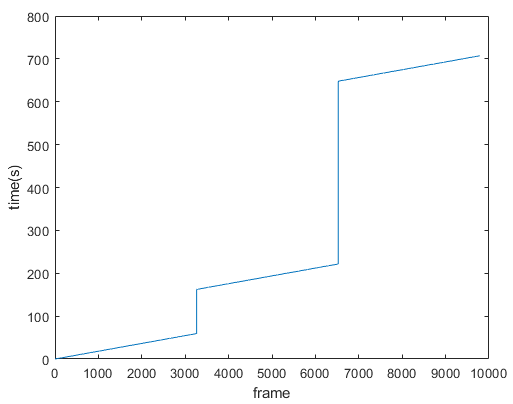

# Recording

The Recording class contains all the Videos acquired at the same time. Each video should start at the same time (Hardware trigger), although stop time may differ between videos. If you did several trials in a recording, you may have to discard inter-trial data.

## Hierarchy

[Analysis_Set](Analysis_Set.md)< [Experiment](Experiment.md) < Recording

## Add/Delete Video

This should be done automatically when you populate an experiment. However, if you remove a video in a folder for example, you can make sure that the listing is correct.

```matlab
%% Select a set of recordings in one experiment
my_set = my_analysis.experiments(1).recordings([2,6,9]);

%% Print recording paths for the recordings above
{my_set.path}'

%% Refresh video list if you deleted a recording
a_recording = my_analysis.experiments(1).recordings(1);
a_recording.update();

% Remove one video in this specific recording
a_recording.pop(1);
```

Get the properties of the recordings videos

Recordings have a few methods collecting properties from lower classes (Video and ROI).

```matlab
%% Print recording paths for a specific recording
my_analysis.experiments(1).recordings(2).path

%% Print path of all videos in the recording
{my_analysis.experiments(1).recordings(2).videos.path}'

%% Get recordings paths for a selected set of recordings
{my_analysis.experiments(1).recordings([2,6,8]).path}'

%% Get video #1 paths for a selected set of recordings
my_set = arrayfun(@(x) x.videos(1).path, [my_analysis.experiments(1).recordings([2,6,8])], 'UniformOutput', false)';

%% Get all video paths for a selected set of recordings
my_set = arrayfun(@(x) {x.videos.path}, [my_analysis.experiments(1).recordings([2,6,8])], 'UniformOutput', false)';

```

Similar to the `videos.path` property above, and once extracted you can collect

`recordings.extracted_results`

`recordings.reference_images`

`recordings.videos.ROI_location`

For example, if wanted to collect the ROIs coordinates from video # 2 in recordings # [1,2,6,8] of experiment # 6 :

```
my_ROIs = arrayfun(@(x) x.videos(2).ROI_location, [my_analysis.experiments(6).recordings([1,2,6,8])], 'UniformOutput', false);
```


## Plot MIs

You can get display the motion indexes for a given recording

### Standard plot

```matlab
%% Simplest plot for a single recording
my_analysis.experiments(1).recordings(1).plot_results();

%% Same as above, but capture the output (one cell per videotype)
[data, time] = my_analysis.experiments(1).recordings(1).plot_results();

%% Get data for a set of recordings (see image below)
[data, time] = my_analysis.experiments(1).recordings([1, 3, 5]).plot_results();
```



Note that if you plot time `figure();plot(time{1})` you can see the separation between recordings.




```matlab
%% You can plot the whole experiment if you omit the recording numbers
my_analysis.experiments(1).recordings.plot_results()

%% Note that this is equivalent to 
my_analysis.experiments(1).plot_results()
```

### Filtering and input options

#### figure number

By default, figure numbers are 1:n_vid, but this can be adjusted

```matlab
%% For example, if we have 2 video_types :

%% Use figure 1 and 2 (default behaviour)
my_analysis.experiments(1).recordings.plot_results();

%% Use figure 456, and 789
my_analysis.experiments(1).recordings.plot_results([456, 789]);

%% Pass figure handles
f1 = figure(123);
f2 = figure(456)
my_analysis.experiments(1).recordings.plot_results([f1, f2]);
```

#### recording time

By default, time is zeroed at the time of the first recording selected. if you set `zero_t` to false, the output is a posix time

```matlab
%% Default behaviour zeroes time
[~, time] = my_analysis.experiments(1).recordings([3, 5]).plot_results('');
time{1}(1)
>> ans = 0

%% Use absolute time
[~, time] = my_analysis.experiments(1).recordings([3, 5]).plot_results('', false);
t = time{1}(1)
>> 1.5700e+09

%% Convert to exact date
datetime(t, 'ConvertFrom', 'posixtime' ,'Format','dd-MMM-yyyy HH:mm:ss.SSSSS')
>> [01-Oct-2019 17:38:21.25439]

```

#### Interactive Browsing

If you have a lot of videos to browse, you can set `manual_browsing` to true. The code will wait for you to close the plot before loading the next one. This is more relevant when looking at multiple experiments at once

```
my_analysis.experiments(1).recordings.plot_results('', '', true)
```

#### Filter specific videos

You want to filter a specific video type when display MIs. 

```matlab
%% To display only 'EyeCam'. Note that unselected videos are returned as empty cells
[data, time] = my_analysis.experiments(1).recordings([3, 5]).plot_results('', '', '', 'Eye')
>> data =
  1×2 cell array
    {0×0 double}    {2966×4 double}
```

#### Apply Specific operation on trace

Once extracted, you can apply an operation a a specific trace (for example filtering) by passing a function handle. First  input in the MI vector

```matlab
%% Apply local moving minimum (to filter laser)
my_analysis.experiments(1).recordings.plot_results('', '', '', '', @(x) movmin(x, 3))

%% Apply gaussian filter
my_analysis.experiments(1).recordings.plot_results('', '', '', '', @(x) smoothdata(x, 'gaussian', [50, 0]))
```

#### Average ROIs, Filter ROIs

By default ROIs with the same name are averaged together. You can choose to average them in a different way, or display only some ROIs

``` matlab
%% By default, ROIs are regrouped and averaged by name
my_analysis.experiments(1).recordings.plot_results('', '', '', '', '', '');

%% Display all ROIs separately, even when the have the same name
my_analysis.experiments(1).recordings.plot_results('', '', '', '', '', false);

%% Display specific ROIs (empty input would show all ROIs)
my_analysis.experiments(1).recordings.plot_results('', '', '', '', '', '', {'Tail', 'Whisker'});

%% Display only Whisker recordings, but do not merge them
my_analysis.experiments(1).recordings.plot_results('', '', '', '', '', false, 'Whisker')
```
#### Display Normalized vs Raw Data

By default, data is normalized for all the selected recordings, but this can be modulated

```matlab
%% Default behaviour does a global normalization across all recordings
my_analysis.experiments(1).recordings.plot_results('', '', '', '', '', '', '', 'global')

%% You can disable normalization
my_analysis.experiments(1).recordings.plot_results('', '', '', '', '', '', '', 'none')

%% You can nomalize each recording individually
my_analysis.experiments(1).recordings.plot_results('', '', '', '', '', '', '', 'local')
```

